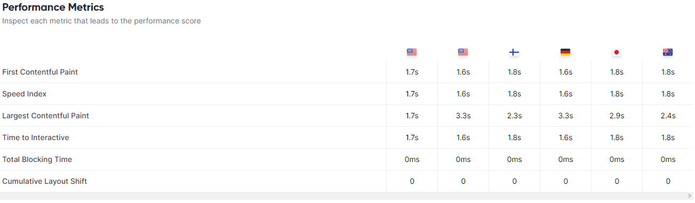
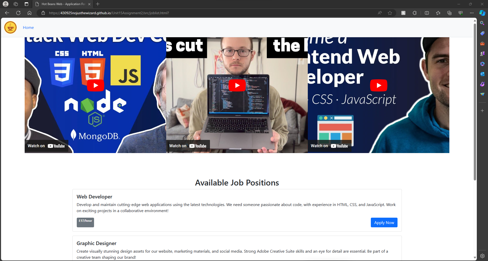

# Unit 15

## Assignment 2

## File Structure

├───assets
│   ├───css
│   └───images
│       ├───Readme
│       └───Website
├───doc
├───git
└───src
    └───Application form

## Tasks to do

## Requirements
 
### Client Requirements
 
+ Have a company profile
+ Have profiles of existing trainee web developers
+ Job specifications and required qualifications
+ An online application form
+ Have links to web development courses
 
### User Requirements
 
+ A website that is accessible
+ A website that is easy to use and understand
+ A website that is easy to navigate
+ A website that is responsive
+ A website that loads within a couple seconds
 
### Developer requirements
 
+ Code needs to be easy to understand
+ Code needs to be easy to maintain
+ Code needs to  have comments explaining functionality

## Storyboard

Profiles of existing trainee web developers

I decided to choose the second sketch as it is more user friendly and easier to navigate, as well as allows for more information to be displayed, while the carousel would be an aesthetically pleasing feature, it would not display all members at once and would require the user to click through to see all members or wait for it to automatically do it.

I have decided to go with the first sketch as it allows for more information to be displayed and is easier to navigate, while the second sketch would fit more, it'd be hard to also provide job descriptions without clicking on the job title.

## Testing

### Functionality & Compatibility Testing

I'll check to see if all of the buttons, links, and interactive elements on my website function properly. In order to accomplish this, I will go through and examine each button, link, and interactive element, noting the outcomes. I'll utilise the website on a variety of browsers and devices to test its compatibility.

### Functionality & Compatibility Testing Results

### Company Profile Page

|                 |Navigation links|Search Bar|Search Button|
|-----------------|----------------|----------|-------------|------------------------|--------------------|
|Works as intended|&#10003;        |     X    |   X         |

### Job list page

|                 |Navigation links|Search Bar|Search Button|Video Links       | Apply Button     |
|-----------------|----------------|----------|-------------|--------------------|------------------|------------------|
|Error |&#10003;   X     |     X    |   X         |     &#10003;     |     &#10003;     |

According to feedback one of the links is not working, I will fix this as soon as possible.
As well as the expand nav bar in mobile view is not working, I will fix this as soon as possible.

### Form Page

|                 |Navigation links|Search Bar|Search Button|Name Input          |Email Input       |Upload CV|Phone Number     |Portfolio link          |Submit            |
|-----------------|----------------|----------|-------------|--------------------|------------------|------------------|------------------|------------------|------------------|
|Works as intended|&#10003;        |     X    |   X         |&#10003;            |     &#10003;     |     &#10003;     |     &#10003;     |     &#10003;     |     &#10003;     |

### Performance test

Using a trustworthy source such as [Lighthouse](https://lighthouse-metrics.com) to test the performance of the website, you can tell how fast it connects which meets client requirements.

### Form Validation

The required fields are unable to be left blank and the email section requires a valid email format.

## Browser test

### OperaGX

Works as expected on OperaGX

### Microsoft Edge

Works as expected on Microsoft Edge

## Device

## Phone

### Company Profile Page

|                 |Navigation links|Search Bar|Search Button|
|-----------------|----------------|----------|-------------|------------------------|--------------------|
|Works as intended|&#10003;        |     X    |   X         |

### Join Us Page

|                 |Navigation links|Search Bar|Search Button|Video Links       | Apply Button     |
|-----------------|----------------|----------|-------------|--------------------|------------------|------------------|
|Error |&#10003;   X     |     X    |   X         |     &#10003;     |     &#10003;     |

### Form Page

|                 |Navigation links|Search Bar|Search Button|Name Input          |Email Input       |Upload CV|Phone Number     |Portfolio link          |Submit            |
|-----------------|----------------|----------|-------------|--------------------|------------------|------------------|------------------|------------------|------------------|
|Works as intended|&#10003;        |     X    |   X         |&#10003;            |     &#10003;     |     &#10003;     |     &#10003;     |     &#10003;     |     &#10003;     |

## Desktop Computer

[Here](#functionality--compatibility-testing-results)

To test it i had asked my peers to test it on their desktop

### Usability Testing

## Feedback

The layout of your website is clean and intuitive, making it easy to navigate and find relevant information. The colour scheme is pleasing to the eye, and the use of whitespace effectively enhances readability and visual appeal. The organization of content is logical, allowing users to quickly locate what they're looking for without feeling overwhelmed. Overall, the design is professional and user-friendly, creating a positive browsing experience for visitors. However, the "Home" link seems to be non-functional; clicking on it doesn't take you home. Another issue with the website is on smaller screens where the navigation toggle button fails to toggle the navbar, rendering the navbar links inaccessible.

### Response

Thank you for your feedback, I will look into the issues you have raised and fix them as soon as possible.

## Conclusion

so just to recall, client requirements were:

+ Have a company profile
+ Have profiles of existing trainee web developers
+ Job specifications and required qualifications
+ An online application form
+ Have links to web development courses

We have met all of the client requirements, we have a Main page containing the company profile, profiles of the trainees, and Job specifications and required qualifications, leading to the second page of even providing a list of job openings for future roles, leading to an online application form, and with the job openings we complete the last requirement which is to have links to a web development course. I believe all the client requirements have been met with high quality.